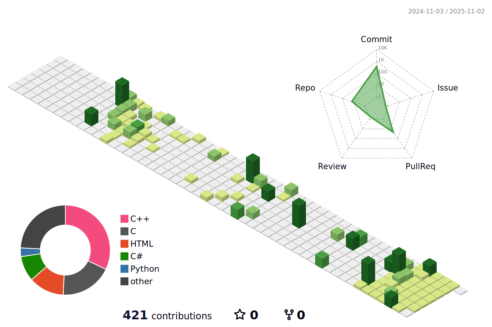

# Yun Junseo 🏖️

<!--  -->
<!-- Ôªø -->

   

       

 

## Skills 🛠️

  
  
  
  

 

My career path is to be a ***Game Client Developer***.

The most commonly used languages are _C++_ and _C#_.

I used to study _Python_ and _Java_, but now I am at a basic level with them.

<!--  -->
<!--  -->
<!--  -->
<!--  -->
<!--  -->
<!--  -->

## Tools ⚒️

  

<!--  -->

I am studying ***Unity*** and ***Unreal Engine*** for game development.

I am developing games directly using each engine.

I have used the _Java Eclipse IDE_ before, but nowadays I only use ***Visual Studio Code***.

## Connections ⛓️‍💥

  

You can connect with me through all of those platforms!

My Gmail address is written on the Profile Bio.

